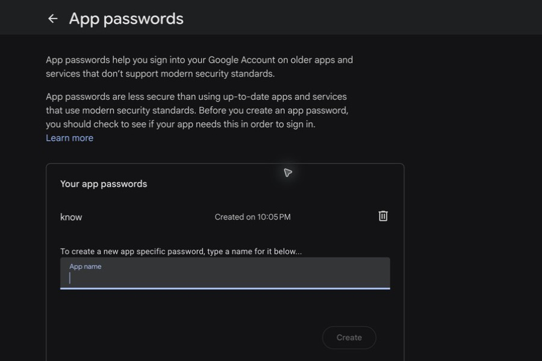
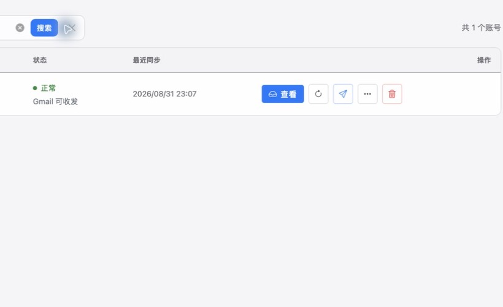
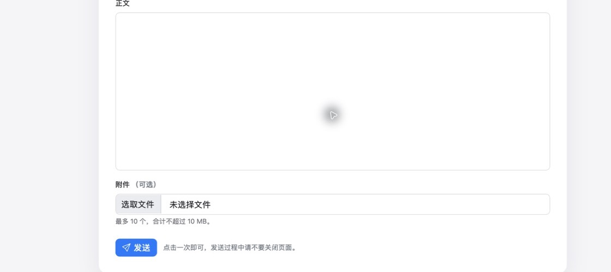
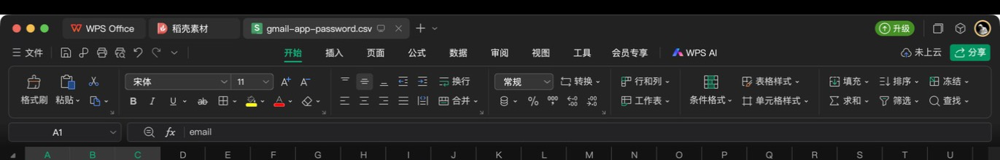

# Gmail 前置授权操作指南（2FA + 应用专用密码）

本指南用于把 Gmail 接入邮箱助手。不要填写 Google 登录密码；使用 Google 生成的 16 位应用专用密码。

## 1. 登录 Google 并开启两步验证

1. 打开 [Google 账号安全页](https://myaccount.google.com/security)。
2. 登录需要接入的 Gmail 账号。
3. 找到“两步验证”，按 Google 页面完成手机、验证器或安全密钥验证。
4. 遇到密码、验证码或安全确认时，由账号本人操作，不要把内容发给其他人。

如果账号属于公司或学校、只允许安全密钥，或启用了高级保护，Google 可能不提供应用专用密码。此时应改用 OAuth。

## 2. 生成应用专用密码

1. 打开 [Google 应用专用密码](https://security.google.com/settings/security/apppasswords)。
2. 在“应用名称”中填写“邮箱助手”。
3. 点击“创建”。



Google 只显示一次这组 16 位密码。立即放入邮箱助手或 CSV，不要截图、不要发到聊天里。页面可能按 `xxxx xxxx xxxx xxxx` 分组显示，邮箱助手会自动去掉空格。

## 3. 在邮箱助手中导入

单个 Gmail 最简单的 CSV 是：

```csv
邮箱,SMTP授权码
name@gmail.com,xxxx xxxx xxxx xxxx
```

也可以与 Yahoo、GMX、Outlook 混放在同一个文件中；程序会逐行识别服务商。Gmail 同时提供 OAuth 与应用专用密码时，会先尝试 OAuth，失败后再尝试应用专用密码。

导入成功后，邮箱列表应显示“Gmail 可收发”。



## 4. 验证收件和发件

1. 点击邮箱右侧的刷新按钮。
2. 等待按钮停止旋转，并确认出现“同步完成，新增 N 封邮件”或“同步完成，未检测到新邮件”。
3. 点击纸飞机按钮，填写收件人、主题和正文后发送一封测试邮件。
4. 到收件方确认收到，并检查 Gmail“已发送”中存在副本。



## 5. 使用 WPS 保存 CSV

1. 第一行填写 `邮箱` 和 `SMTP授权码`。
2. 每个账号一行，不要合并单元格。
3. 选择“另存为”，文件类型选 CSV UTF-8。
4. 导入完成后，把含凭据的 CSV 移到安全位置或删除，不要提交到 Git 仓库。



## 常见问题

- 提示密码错误：确认使用的是 16 位应用专用密码，不是 Google 登录密码。
- 找不到应用专用密码：先确认两步验证已开启；公司/学校账号还可能被管理员禁用。
- 刚修改 Google 密码后无法同步：Google 会撤销旧应用专用密码，需要重新生成。
- OAuth 可以收件但不能发件：重新授权并确保授权范围允许完整邮件访问；也可同时填写应用专用密码作为备用。
